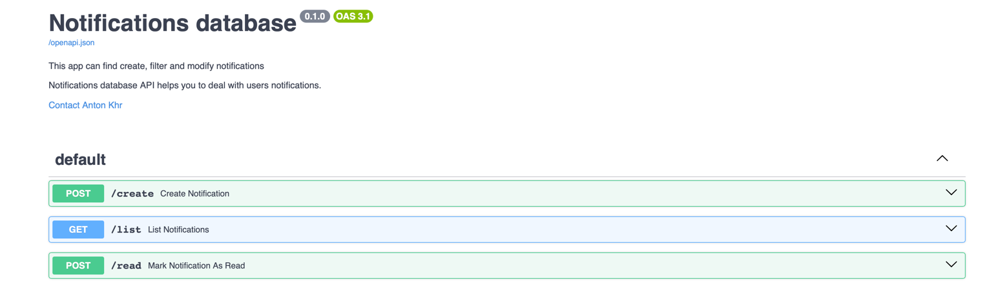

# Notifications server

### _FastAPI + mongoDB + SMTPlib_

Проект представляет собой серверное приложение, построенное с использованием FastAPI, которое предоставляет API для
управления и взаимодействия с уведомлениями пользователей и отправки email-уведомлений. 

# Запуск:
```code
docker-compose build

docker-compose up -d 
```

# Описание

## <span style="color:lightblue;">[POST]</span>
## Создание уведомлений (<span style="color:orange;">/create</span>):
Создает уведомление и отправляет письмо пользователю
#### Тело запроса:

- user_id - строка на 24 символа (является ObjectID документа пользователя которому отправляется уведомление)
- target_id - строка на 24 символа (является ObjectID документа сущности, к которой относится уведомление) (Может отсутствовать)
- key - ключ уведомления enum
    - registration (Только отправит пользователю Email)
    - new_message (только создаст запись в документе пользователя)
    - new_post (только создаст запись в документе пользователя)
    - new_login (Создаст запись в документе пользователя и отправит email)
- data - произвольный объект из пар ключ/значение (Может отсутствовать)


#### Пример тела запроса:

```json
{
    "user_id": "638f394d4b7243fc0399ea67",
    "key": "registration",
}
```

#### Пример ответа

HTTP 201 Created

```json
{
    "success": true,
}
```
## <span style="color:lightgreen;">[GET]</span>
## Поиск уведомлений (/list):
производит листинг уведомлений пользователя.<br>

#### query params
- user_id [string] - идентификатор пользователя
- skip [int] - кол-во уведомлений, которые следует пропустить
- limit [int] - кол-во уведомлений которые следует вернуть


#### Пример ответа

HTTP 200 Ok

```json
{
    "success": true,
    "data": {
        "elements": 23, // всего уведомлений
        "new": 12, // Кол-во непрочитанных уведомлений
        "request": {
            "user_id": "638f394d4b7243fc0399ea67",
            "skip": 0,
            "limit": 10,
        }
        "list": [
            {
                "id": "some_notification_id",
                "timestamp": 1698138241,
                "is_new": false,
                "user_id": "638f394d4b7243fc0399ea67",
                "key": "new_message",
                "target_id": "0399ea67638f394d4b7243fc",
                "data": {
                    "some_field": "some_value"
                },
            },
            ...
        ]
    }
}
```

## <span style="color:lightblue;">[POST]</span>
## Отметка о прочтении уведомления (<span style="color:orange;">/read</span>):
#### query params
- user_id [string] - идентификатор пользователя
- notification_id [string] - идентификатор уведомления

#### Пример ответа

HTTP 200 Ok

```json
{
    "success": true,
}
```


## Переменные окружения, через которые конфигурируется сервис

- PORT - порт на котором будет работать приложение
- EMAIL - тестовый email
- DB_URI - строка для подключения к mongoDB
- SMTP_HOST - хост smtp сервера
- SMTP_PORT - порт smtp сервера
- SMTP_LOGIN - логин пользователя
- SMTP_PASSWORD - пароль пользователя
- SMTP_EMAIL - email с которого будет отправлено сообщение
- SMTP_NAME - Имя отображаемое у получателя письма

